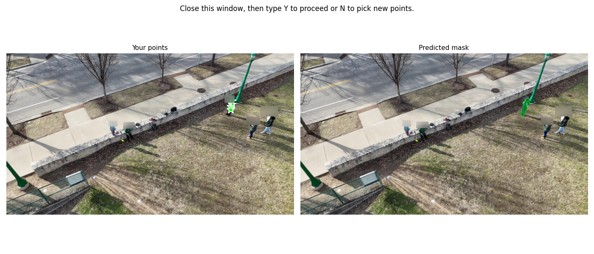

# EgoAlign

	

A toolkit for aligning motion capture, egocentric video, and gaze data into a unified SE(3) coordinate system. Designed for multimodal sensor fusion, embodied perception, and analysis of real-world behavior.

Dependencies:
- ViT Pose
- SAM2
- Shadow.fileio

Shadow:

To detect the grounded foot at each time-step, run the following command:

`python detect_steps.py --shadow_dir <path/to/shadow/> --out_csv <detected_steps.csv>` 

The resulting .csv file will contain the grounded foot at each timestamp, calculated using Shadow's pressure sensors. The .csv also contains the 3D body positions.

	

DJI:

To track the subject throughout the third-person video and get the corresponding bounding boxes, run:

`python segment_video --frames <path/to/frames> --output <sam2_output.mp4> --fps <output_fps> --checkpoint <path/to/sam.pt> --config <path/to/config.yaml> --out_csv output_bboxes.csv`

Upon running, you will be prompted to select points belonging to the subject. After closing the window, the following window will appear so that you can verify the mask: 

	

Upon closing, the script automatically generate the segmentation masks and bounding boxes for the rest of the video.

To get the 2D pose of the subject in each frame, run the following command:

`python vitpose_inference.py --video <path/to/dji_video.mp4> --output_dir <path/to/vitpose_output> --bbox_csv <path/to/sam_bboxes.csv> --checkpoints_dir <path/to/vitpose_checkpoints>`

	

- Run ViT
- Filter ViT using SAM2
- Find heel intersections

Aria: 

- Process semidense points

Align Shadow + DJI

- rigid_align.py to align heels with environment

Align Shadow + DJI + Aria 

- align_reconstructions.py to find cameras in DJI space
- find gaze intersections

View with walk_viewer.py
