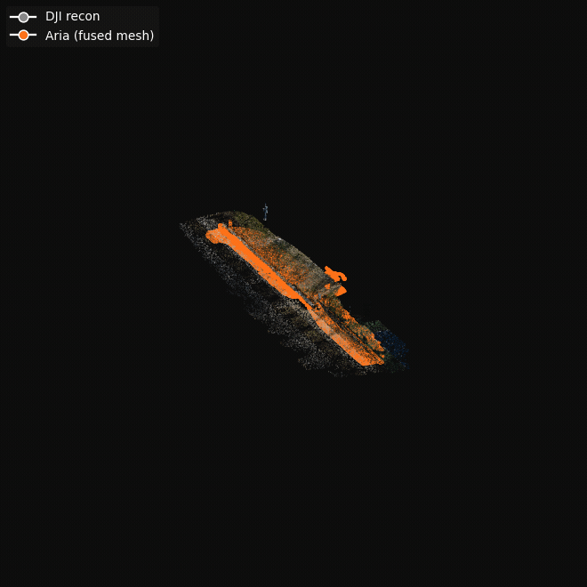

# EgoAlign

<p align="center">
  
</p>

A toolkit for aligning motion capture, egocentric video, and gaze data into a unified SE(3) coordinate system. Designed for multimodal sensor fusion, embodied perception, and analysis of real-world behaviour.

EgoAlign fuses three heterogeneous data streams, **Shadow MoCap** (body skeleton + pressure), **DJI drone video** (third-person photogrammetry), and **Meta Aria** (egocentric video + eye gaze), into a single coordinate frame so they can be visualised and analysed together.

---

## Table of Contents

1. [Dependencies](#dependencies)
2. [Pipeline Overview](#pipeline-overview)
3. [Step-by-Step Usage](#step-by-step-usage)
   - [1. Extract Shadow MoCap data](#1-extract-shadow-mocap-data)
   - [2. Segment subject in DJI video](#3-segment-subject-in-dji-video)
    - [3. 2D pose estimation with ViTPose](#4-2d-pose-estimation-with-vitpose)
   - [4. Time-sync DJI to Shadow](#2-time-sync-dji-to-shadow)
   - [5. Compute median heel positions](#5-compute-median-heel-positions)
   - [6. Align Shadow skeleton to DJI reconstruction](#6-align-shadow-skeleton-to-dji-reconstruction)
   - [7. Process Aria egocentric data](#7-process-aria-egocentric-data)
   - [8. Align DJI and Aria reconstructions](#8-align-dji-and-aria-reconstructions)
   - [9. Apply transforms and compute gaze](#9-apply-transforms-and-compute-gaze)
   - [10. Visualise the result](#10-visualise-the-result)

---

## Dependencies

| Package | Purpose |
|---|---|
| [Shadow fileio](https://www.motionshadow.com) (`shadow.fileio`) | Read Shadow MoCap `.mStream` / `.mTake` files |
| [ViTPose](https://github.com/ViTAE-Transformer/ViTPose) | 2D human pose estimation in DJI frames |
| [SAM2](https://github.com/facebookresearch/segment-anything-2) | Interactive video segmentation for subject tracking |
| [EFM3D / projectaria_tools](https://github.com/facebookresearch/projectaria_tools) | Aria device data, MPS eye gaze, and closed-loop trajectory |
| [RealityScan](https://www.unrealengine.com/en-US/realityscan) | DJI photogrammetry reconstruction (`.ply` + `.json`) |
| Open3D | 3D visualisation and raycasting |
| NumPy, SciPy, pandas | Numerics and data handling |
| pytz, timezonefinder | Timezone conversion for DJI SRT time-sync |

---

## Pipeline Overview

---

## Step-by-Step Usage

### 1. Extract Shadow MoCap data

Reads the Shadow `.mStream` binary and pressure sensor data, detects grounded-foot events at each timestep using the foot pressure sensors, and writes one row per frame.

```bash
python detect_steps.py \
    --shadow_dir <path/to/shadow/> \
    --out_csv    detected_steps.csv
```

**Outputs:** `detected_steps.csv` — one row per Shadow frame containing:
- UTC timestamp
- 3D joint positions for all body nodes
- `max_pressure_foot` (which foot is grounded)

<p align="center">
  
</p>

---
### 2. Segment subject in DJI video

Uses SAM2 to interactively track the subject through the third-person DJI video and produce per-frame bounding boxes.

```bash
python segment_video.py \
    --frames     <path/to/frames/> \
    --output     sam2_output.mp4 \
    --fps        <output_fps> \
    --checkpoint <path/to/sam2.pt> \
    --config     <path/to/sam2_config.yaml> \
    --out_csv    output_bboxes.csv
```

When launched, you will be prompted to **click a point on the subject** in the first frame. A preview window then shows the predicted mask so you can verify it before the script propagates the segmentation through the rest of the video automatically.

<p align="center">
  
</p>

**Outputs:** `output_bboxes.csv` — per-frame bounding boxes for the subject.

---

### 3. 2D pose estimation with ViTPose

Runs ViTPose on each DJI frame, cropped to the SAM2 bounding box, to get COCO-WholeBody 133-keypoint 2D poses.

```bash
python vitpose_inference.py \
    --video          <path/to/dji_video.mp4> \
    --output_dir     <path/to/vitpose_output/> \
    --bbox_csv       <path/to/output_bboxes.csv> \
    --checkpoints_dir <path/to/vitpose_checkpoints/>
```

**Outputs:** Per-frame `dji_*_keypoints.json` files in the output directory.

<p align="center">
  
</p>

---

### 4. Time-sync DJI to Shadow

Aligns the DJI video timeline to the Shadow MoCap timeline via a two-stage search:

1. **Coarse** — converts the DJI local timestamp to UTC using the GPS-derived timezone to estimate the clock offset Δ.
2. **Fine** — sweeps a ±`COARSE_MARGIN`-second window around Δ, maximising the Pearson correlation between the vertical heel oscillation signal in ViTPose keypoints and the Shadow `RightHeel_z − LeftHeel_z` signal.

```bash
python time_sync.py \
    --srt_path  dji/DJI_20260228161138_0012_D.SRT \
    --steps_csv detected_steps.csv \
    --pose_dir  vitpose/vitpose_output \
    --out_csv   time_aligned_steps.csv
```

> **Note:** The script assumes both devices were started at approximately the same time (within 10 seconds). If this assumption does not hold, increase the `COARSE_MARGIN` constant at the top of the script.

**Outputs:** `time_aligned_steps.csv` — Shadow rows resampled to DJI frame rate, with two extra columns: `matched_srt_time` and `dji_frame`.

---

### 5. Compute median heel positions

For each discrete footstep event this script computes the median 3D heel position in both DJI world space and Shadow space, which are then used as correspondences for skeleton alignment.

**DJI space:** The 2D heel pixel (from ViTPose keypoint indices 19/22 — COCO-WholeBody left/right heel) is projected along a ray into the DJI photogrammetry mesh and the intersection point is recorded.

**Shadow space:** Foot-slippage (skateboarding) artifacts are corrected first, then the median heel position within each stance event is computed.

```bash
python process_heels.py \
    --pose_dir  <path/to/vitpose_output/> \
    --steps_csv time_aligned_steps.csv \
    --ply_path  dji/recon_1.ply \
    --json_path dji/recon_1.json \
    --out_csv   median_heel_positions.csv
```

**Outputs:** `median_heel_positions.csv` — one row per footstep with median heel positions in both coordinate spaces.

---

### 6. Align Shadow skeleton to DJI reconstruction

Fits the Shadow heel positions to the DJI heel positions using a **windowed Umeyama similarity transform** with Gaussian smoothing across windows. Three windowing modes are available:

| Mode | Flag | Description |
|---|---|---|
| **Adaptive** *(default)* | *(none)* | Two-pass: broad windows for stable regions, tighter windows where residuals are high (turns, elevation changes). |
| **Fixed** | `--fixed-window` | Uniform windows of size `--window-size` (default 30 steps). |
| **Rotation** | `--rotation-window` | Splits windows at points of significant heading change (threshold set by `--rotation-threshold`). |

All modes support `--global-rotation` (fixed/adaptive only), which fits one global rotation and allows only windowed translation — preventing orientation drift across windows.

```bash
python rigid_align.py \
    --heels-csv  median_heel_positions.csv \
    --ply        dji/recon_1.ply \
    --out-csv    median_heel_positions_aligned.csv \
    --out-npz    umeyama_transform.npz \
    --plot-path  topdown_2d.png \
    [--fixed-window | --rotation-window] \
    [--window-size W]              \   # fixed mode (default: 30)
    [--base-window W]              \   # adaptive mode max window (default: 60)
    [--min-window  W]              \   # adaptive mode min window (default: 8)
    [--residual-threshold K]       \   # adaptive threshold = mean + K*std (default: 1.5)
    [--smooth-sigma S]             \   # Gaussian σ across steps (default: 5)
    [--rotation-threshold D]       \   # heading change (°) to start new window (default: 30)
    [--rotation-min-steps M]       \   # min steps per rotation window (default: 20)
    [--heading-smooth S]           \   # σ for trajectory smoothing before heading calc (default: 5)
    [--global-rotation]            \   # one global rotation + windowed translation
    [--no-2d-plot]                 \   # skip saving the top-down PNG
    [--no-aria]                    \   # disable Aria head-position constraint
    [--detected-steps-csv FILE]    \   # detected_steps.csv (Aria head constraint)
    [--frame-positions     FILE]   \   # aria/frame_positions.json (Aria head constraint)
    [--dji-aria-matches    FILE]   \   # dji_aria_frame_matches.csv (Aria head constraint)
    [--time-aligned        FILE]   \   # time_aligned_steps.csv (Aria head constraint)
    [--alignment-npz       FILE]       # alignment_transform.npz (Aria head constraint)
```

**Open3D viewer controls:** left-drag to rotate, right-drag to pan, scroll to zoom, Q/Esc to quit.

**Outputs:**
- `umeyama_transform.npz` (or value of `--out-npz`) — per-step rotation quaternions, translations, and scales
- `topdown_2d.png` (or value of `--plot-path`) — top-down 2D plot of the trajectory coloured by window, with DJI hits and window boundary markers

---

### 7. Process Aria egocentric data

Extracts RGB frames and eye-gaze projections from the Aria `.vrs` file using the MPS pipeline.

```bash
python process_aria.py \
    --vrs      path/to/recording.vrs \
    --gaze-csv path/to/mps/eye_gaze/general_eye_gaze.csv \
    --out-dir  rgb_frames_with_gaze
```

**Outputs** (inside `--out-dir`):
- `images/` — extracted Aria RGB frames (PNG, zero-padded filenames)
- `frames.csv` — per-frame gaze pixel coordinates (`gaze_u_px`, `gaze_v_px`), depth, and `has_gaze` flag

<p align="center">
  
</p>

---

### 8. Align DJI and Aria reconstructions

Interactive tool that aligns the DJI photogrammetry mesh to the Aria semi-dense reconstruction using manually picked correspondences followed by ICP refinement.

1. Pick N corresponding points on the **DJI** mesh.
2. Pick the same N points (same order) on the **Aria** mesh.
3. A rigid Umeyama alignment is computed, then optionally refined with ICP.
4. The combined transform is saved.

```bash
python align_reconstructions.py \
    --source  dji/recon_1.ply \
    --target  aria/fused_mesh_cleaned.ply \
    --output  alignment_transform.npz \
    [--sample-source  N]   \   # points to sample from source (default: 300000)
    [--sample-target  N]   \   # points to sample from target (default: all)
    [--icp-threshold  T]   \   # ICP max-correspondence distance (default: auto)
    [--icp-iterations I]   \   # ICP max iterations (default: 200)
    [--no-icp]                 # skip ICP; use Umeyama only
```

**Open3D pick-window controls:** Shift+left-click to add a point, Shift+right-click to undo, Q/Esc to confirm.

**Outputs:** `alignment_transform.npz` — 4×4 homogeneous transform `T_total` mapping DJI world → Aria world (inverted at runtime to get Aria → DJI).

<p align="center">
  
</p>

---

### 9. Apply transforms and compute gaze

Applies the windowed Umeyama transforms to the full Shadow skeleton, then for every frame looks up the Aria device pose, transforms it to DJI world space, and casts the gaze ray against the DJI mesh to find the 3D intersection point.

```bash
python align_body.py \
    --steps-csv time_aligned_steps.csv \
    --npz       umeyama_transform.npz \
    --out-csv   detected_steps_aligned.csv \
    [--dji-aria-matches dji_aria_frame_matches.csv] \
    [--closed-loop-traj aria/closed_loop_trajectory.csv] \
    [--frames-csv       aria/frames.csv] \
    [--alignment-npz    alignment_transform.npz] \
    [--ply              dji/recon_1.ply]
```

The three required arguments (`--steps-csv`, `--npz`, `--out-csv`) must always be provided. The five Aria/mesh arguments are optional — if any are omitted, Aria camera and gaze columns are skipped with a warning and the output CSV is written without them.

**Gaze raycasting backend:** Open3D BVH is tried first; trimesh (with optional pyembree acceleration) is used as a fallback.

**Outputs:** `detected_steps_aligned.csv` — one row per Shadow frame containing:

| Column group | Description |
|---|---|
| `{Joint}_aligned_x/y/z` | All skeleton joints in DJI world space |
| `cam_pos_x/y/z` | Camera position (= aligned Head joint) |
| `cam_rot_r00`…`cam_rot_r22` | 3×3 camera rotation, row-major (9 columns) |
| `gaze_x/y/z` | 3D mesh intersection of the gaze ray (NaN if no hit) |
| `gaze_valid` | 1 if the ray hit the mesh, 0 otherwise |

---

### 10. Visualise the result

Interactive 3D viewer showing the aligned skeleton walking through the DJI reconstruction, with the Aria camera frustum and live gaze ray.

```bash
python walk_viewer.py \
    --ply        dji/recon_1.ply \
    --csv        detected_steps_aligned.csv \
    --frames-dir walk_frames
```

**Viewer controls:**

| Key / Action | Effect |
|---|---|
| Mouse left-drag | Rotate |
| Mouse right-drag | Pan |
| Scroll | Zoom |
| Space | Pause / resume animation |
| Left / Right arrows | Step one frame (while paused) |
| R | Restart from frame 0 |
| `[` / `]` | Slow down / speed up (0.25× – 4×) |
| F | Toggle Aria camera frustum + trajectory |
| G | Toggle gaze ray |
| Q or Esc | Quit |

<p align="center">
  
</p>


